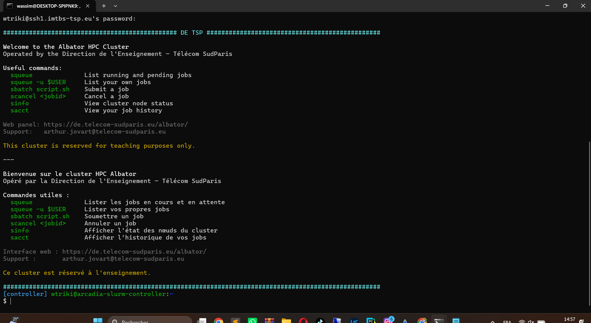
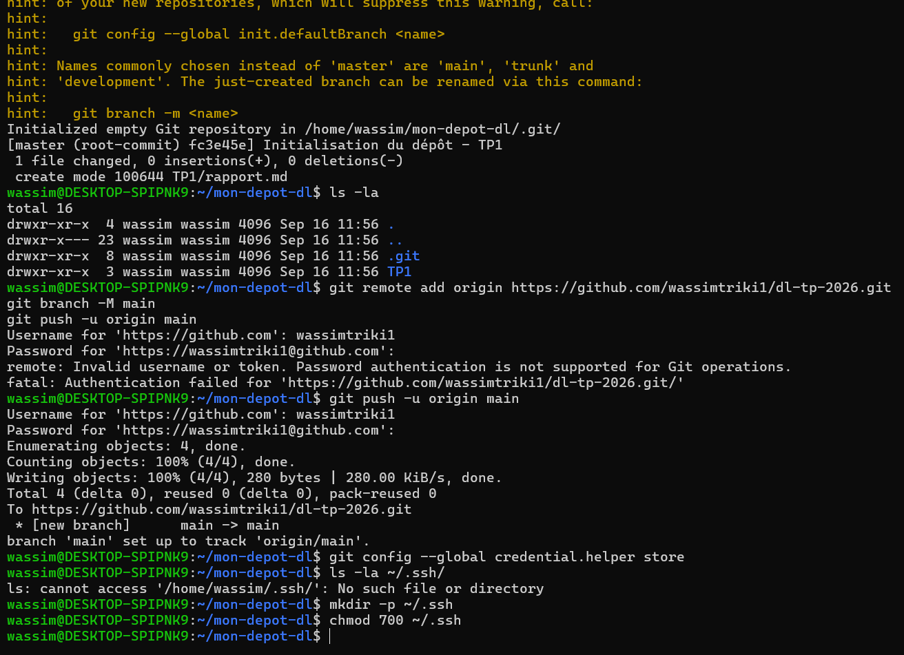
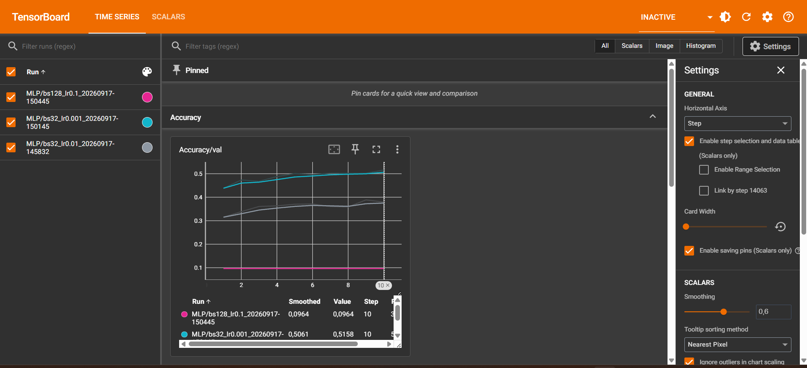

# TP1 — Premiers pas (Deep Learning)

**Auteur :** Wassim Triki
**Identifiant TSP :** wtriki
**Dépôt Git :** https://github.com/wassimtriki1/dl-tp-2026

---

## 1. Utilisation de SLURM

### 1.1 Connexion SSH et allocation interactive

La connexion au cluster Albator se fait via une passerelle SSH (`LAB_GATEWAY`) puis un `ProxyJump` vers la machine de connexion du cluster (`tsp-client`), configurés dans `~/.ssh/config`. Une paire de clés SSH (ed25519) a été générée et déposée sur le serveur.


*Figure 1 — Connexion réussie au cluster Albator (arcadia-slurm-controller), identifiant wtriki.*

Commande utilisée pour obtenir une allocation GPU interactive :
```bash
srun --partition=gpu --gres=gpu:1 --time=01:00:00 --cpus-per-task=1 --mem=8G --pty bash
```

**Modèle exact du GPU alloué :** `NVIDIA L4` (23034 MiB de mémoire, driver 595.84, CUDA 13.2)

Sortie de `nvidia-smi` une fois dans l'allocation :
```
Wed Sep 16 13:03:31 2026
+-----------------------------------------------------------------------------------------+
| NVIDIA-SMI 595.84                 Driver Version: 595.84         CUDA Version: 13.2     |
+-----------------------------------------+------------------------+----------------------+
|   0  NVIDIA L4                      Off |   00000000:06:10.0 Off |                    0 |
| N/A   34C    P8             16W /   72W |       3MiB /  23034MiB |      0%      Default |
+-----------------------------------------+------------------------+----------------------+
No running processes found
```

### 1.2 Observer et arrêter ses jobs

```bash
squeue -u $USER
```

**Commande exacte utilisée pour annuler le job :**
```bash
scancel 1542
```

Vérification après annulation (le job passe brièvement à l'état `CG` - Completing - avant de disparaître) :
```
$ squeue -u $USER
             JOBID PARTITION     NAME     USER ST       TIME  NODES NODELIST(REASON)
              1542       gpu     bash   wtriki  R      42:00      1 starfighter-slurm-node-01-1
$ scancel 1542
$ squeue -u $USER
             JOBID PARTITION     NAME     USER ST       TIME  NODES NODELIST(REASON)
              1542       gpu     bash   wtriki CG      42:19      1 starfighter-slurm-node-01-1
$ squeue -u $USER
(liste vide - job terminé)
```

### 1.3 Soumission d'un script non-interactif avec sbatch

Script `hello.sh` complété :
```bash
#!/bin/bash
#SBATCH --partition=gpu
#SBATCH -t 01:00:00
#SBATCH --gres=gpu:1
#SBATCH --cpus-per-task=1
#SBATCH --mem=8G
#SBATCH -J hello-slurm
#SBATCH -o logs/%x-%j.out
#SBATCH -e logs/%x-%j.err

set -euo pipefail
mkdir -p logs

echo "Job $SLURM_JOB_ID on $SLURM_NODELIST"
nvidia-smi || echo "nvidia-smi indisponible"
echo "Bonjour depuis SLURM !"
```

Soumis avec `sbatch hello.sh` → JobID **1549**.

**Nom exact du fichier de log généré : `hello-slurm-1549.out`**

Extrait du contenu :
```
Job 1549 on starfighter-slurm-node-01-1
NVIDIA L4 ... 0MiB / 23034MiB ... 0% Default
Bonjour depuis SLURM !
```

### 1.4 Analyser ses jobs : sacct

```bash
sacct -j 1549 --format=JobID,State,Elapsed,MaxRSS,ReqMem,ReqCPUS
```
```
JobID             State    Elapsed     MaxRSS     ReqMem  ReqCPUS
------------ ---------- ---------- ---------- ---------- --------
1549          COMPLETED   00:00:01                    8G        1
1549.batch    COMPLETED   00:00:01     17980K                   1
1549.extern   COMPLETED   00:00:01                              1
```

**Différence entre `ReqMem` et `MaxRSS` :** `ReqMem` correspond à la mémoire demandée à Slurm au moment de la soumission (réservation, ici 8 Go). `MaxRSS` correspond à la mémoire réellement utilisée pendant l'exécution, mesurée ici à seulement 17 980 Ko (≈17,5 Mo) sur la sous-tâche `1549.batch`. Cet écart illustre la différence entre la réservation prudente auprès de l'ordonnanceur et la consommation réelle d'un script aussi léger que `hello.sh`.

---

## 2. Création d'un environnement virtuel Python

### 2.1 Installation de Miniforge/Mamba et création de l'environnement

```bash
curl -L -O "https://github.com/conda-forge/miniforge/releases/latest/download/Miniforge3-$(uname)-$(uname -m).sh"
bash Miniforge3-$(uname)-$(uname -m).sh
mamba create -n deeplearning python=3.10
mamba activate deeplearning
```

**Commande pour vérifier la version de Python et le chemin du binaire :**
```bash
python --version
which python
```
Résultat :
```
Python 3.10.21
/mnt/hdd/homes/wtriki/miniforge3/envs/deeplearning/bin/python
```

### 2.2 Installation de PyTorch (GPU) + TensorBoard

Première tentative :
```bash
mamba install pytorch torchvision torchaudio pytorch-cuda=12.1 -c pytorch -c nvidia
```

Cette commande a installé par défaut une variante **CPU** de PyTorch (`pytorch-2.13.0-cpu_mkl_...`) malgré la spécification `pytorch-cuda=12.1`. Après vérification avec `check_gpu.py`, `CUDA available` retournait `False`. Problème corrigé en forçant explicitement la variante CUDA :
```bash
mamba remove pytorch torchvision torchaudio pytorch-cuda
mamba install "pytorch=*=*cuda*" torchvision torchaudio pytorch-cuda=12.1 -c pytorch -c nvidia
mamba install tensorboard -c conda-forge
```

### 2.3 Vérification de l'installation PyTorch + CUDA

`check_gpu.py` :
```python
import torch

print("PyTorch version:", torch.__version__)
gpu_available = torch.cuda.is_available()
print("CUDA available:", gpu_available)

if gpu_available:
    print("Device count:", torch.cuda.device_count())
    print("Device 0 name:", torch.cuda.get_device_name(0))
else:
    print("Attention, aucun GPU détecté !")
```

**Sortie obtenue après correction :**
```
PyTorch version: 2.5.1.post303
CUDA available: True
Device count: 1
Device 0 name: NVIDIA L4
```

**Deux raisons possibles si `CUDA available` retourne `False` :**
1. Le script n'a pas été exécuté dans une allocation Slurm avec GPU (`srun --gres=gpu:1`).
2. La variante de PyTorch installée est une version CPU au lieu de CUDA — c'est ce qui s'est produit ici : `mamba install pytorch ... -c pytorch -c nvidia` a sélectionné un build `cpu_mkl` malgré `pytorch-cuda=12.1`.

### 2.4 Rendre l'environnement reproductible

```bash
mamba env export --from-history -n deeplearning > environment.yml
```
```yaml
name: deeplearning
channels:
  - conda-forge
  - pytorch
dependencies:
  - pip
  - python=3.10
  - pytorch[build="*cuda*"]
  - pytorch-cuda=12.1
  - tensorboard
  - torchaudio
  - torchvision
prefix: "/mnt/hdd/homes/wtriki/miniforge3/envs/deeplearning"
```

### 2.5 Bonus — Vérifier TensorBoard

```bash
tensorboard --version
```
Résultat : `2.20.0`

### 2.6 Gestion du dépôt Git

Le dépôt a été initialisé localement, connecté à GitHub via un Personal Access Token, puis poussé avec succès :


*Figure 2 — Initialisation du dépôt local, ajout du rapport, connexion au remote GitHub et premier push réussi.*

---

## 3. Exercices théoriques

### 3.1 Architecture et paramètres

Perceptron multicouche (MLP) avec une couche d'entrée de 3 neurones, une couche cachée de 4 neurones, et une couche de sortie de 2 neurones.

*(📸 Insérer ici la photo du schéma dessiné à la main : ``)*

**Nombre total de paramètres, sans les biais :**
- Couche 1 (entrée → cachée) : 3 × 4 = 12
- Couche 2 (cachée → sortie) : 4 × 2 = 8
- **Total sans biais = 20**

**Avec les biais :**
- Couche 1 : 12 + 4 = 16
- Couche 2 : 8 + 2 = 10
- **Total avec biais = 26**

### 3.2 Équations et dimensions

```
H = ReLU( X · W1^T + b1 )
Y = H · W2^T + b2

X  : (N, 3)
W1 : (4, 3)
b1 : (1, 4) -> diffusé en (N, 4)
H  : (N, 4)
W2 : (2, 4)
b2 : (1, 2) -> diffusé en (N, 2)
Y  : (N, 2)
```

### 3.3 Graphe de calcul et rétropropagation

Fonction : $f(x, y, z) = \frac{x}{y} + z$, avec un nœud intermédiaire $q = \frac{x}{y}$.

```
x ──┐
    ├─▶ [ ÷ ] ──▶ q ──┐
y ──┘                 ├─▶ [ + ] ──▶ f
z ────────────────────┘
```

**Forward pass** (x = 2, y = 4, z = 0) :
$$q = \frac{x}{y} = 0.5 \qquad f = q + z = 0.5$$

**Backpropagation :**
- $\frac{\partial f}{\partial q} = 1$, $\frac{\partial f}{\partial z} = 1$
- $\frac{\partial q}{\partial x} = \frac{1}{y} = 0.25$
- $\frac{\partial q}{\partial y} = -\frac{x}{y^2} = -0.125$

Par la chain rule :
$$\frac{\partial f}{\partial x} = 0.25 \qquad \frac{\partial f}{\partial y} = -0.125 \qquad \frac{\partial f}{\partial z} = 1$$

### 3.4 Mise à jour des poids (η = 1)

$$x' = 1.75 \qquad y' = 4.125 \qquad z' = -1$$
$$f' = \frac{1.75}{4.125} - 1 \approx -0.576$$

La valeur de la fonction a bien **diminué** (de 0.5 à −0.576), comme attendu.

### 3.5 Questions de réflexion

**Pourquoi la chain rule pour les réseaux profonds ?**
Un réseau profond est une composition de nombreuses fonctions (les couches). La chain rule permet de calculer le gradient de la loss par rapport à n'importe quel paramètre en multipliant les dérivées locales le long du chemin entre la sortie et ce paramètre — c'est le principe de la rétropropagation.

**Pourquoi utiliser des mini-batchs ?**
Un seul exemple donne un gradient très bruité et n'exploite pas le parallélisme GPU. Le dataset entier donne un gradient exact mais coûteux à calculer, et converge lentement en temps réel. Les mini-batchs offrent un compromis : estimation raisonnable du gradient, bon usage du parallélisme matériel, et un peu de bruit qui aide à échapper aux minima locaux.

### 3.6 Association

| Tâche | Fonction finale (Sortie) | Fonction de perte (Loss) |
|---|---|---|
| Classification binaire | 1. Sigmoïde | A. Binary Cross-Entropy |
| Classification multi-classes | 2. Softmax | B. Cross-Entropy |
| Régression pure | 3. Identité (aucune) | C. MSE |

---

## 4. Premier réseau de neurones (train.py)

### 4.1 Préparation des données

```python
trainset = datasets.CIFAR10(root='./data', train=True, download=True, transform=transform)
testset  = datasets.CIFAR10(root='./data', train=False, download=True, transform=transform)

trainloader = torch.utils.data.DataLoader(trainset, batch_size=32, shuffle=True, num_workers=num_workers, pin_memory=True)
testloader = torch.utils.data.DataLoader(testset, batch_size=32, shuffle=False, num_workers=num_workers, pin_memory=True)
```

**Rôle de `batch_size` et `shuffle` :** `batch_size` définit le nombre d'exemples traités ensemble avant une mise à jour des poids. `shuffle=True` pour l'entraînement mélange l'ordre à chaque époque (évite d'apprendre un ordre particulier, respecte l'hypothèse i.i.d. de SGD). `shuffle=False` pour le test car l'ordre n'a aucune importance pour l'évaluation.

### 4.2 Implémentation du réseau (MLP)

```python
class MLP(nn.Module):
    def __init__(self):
        super().__init__()
        self.fc1 = nn.Linear(32 * 32 * 3, 128)
        self.fc2 = nn.Linear(128, 10)

    def forward(self, x):
        x = torch.flatten(x, 1)
        x = F.relu(self.fc1(x))
        x = self.fc2(x)
        return x
```

**Pourquoi `torch.flatten(x, 1)` ?** `nn.Linear` attend une entrée 2D (batch, features). Cette opération aplatit canaux et pixels en un vecteur par exemple, en préservant la dimension batch.

**Pourquoi pas de Softmax avant `nn.CrossEntropyLoss` ?** Cette loss applique déjà `LogSoftmax` + `NLLLoss` en interne ; ajouter un Softmax appliquerait l'opération deux fois, faussant loss et gradients.

### 4.3 Entraînement du modèle

```python
optimizer.zero_grad(set_to_none=True)
outputs = model(inputs)
loss = criterion(outputs, labels)
loss.backward()
optimizer.step()
```

**Différence entre `zero_grad()` et `backward()` :** `zero_grad()` réinitialise les gradients accumulés (PyTorch les accumule par défaut). `backward()` calcule via rétropropagation les gradients de la loss et les stocke dans `.grad`.

**Résultats (10 époques) :**
```
Epoch 01 | loss=2.0830 | acc=0.3334
Epoch 02 | loss=2.1251 | acc=0.3586
Epoch 03 | loss=2.1198 | acc=0.3682
Epoch 04 | loss=2.0930 | acc=0.3819
Epoch 05 | loss=2.0538 | acc=0.3897
Epoch 06 | loss=2.0477 | acc=0.3943
Epoch 07 | loss=2.0145 | acc=0.4041
Epoch 08 | loss=1.9995 | acc=0.4099
Epoch 09 | loss=1.9602 | acc=0.4211
Epoch 10 | loss=1.9462 | acc=0.4248
```

### 4.4 Évaluation sur l'ensemble de test

**Pourquoi `with torch.no_grad():` à l'évaluation ?** Désactive le suivi du graphe autograd (pas de backward nécessaire), réduisant mémoire et accélérant la passe avant.

**Précision attendue en aléatoire :** CIFAR-10 a 10 classes équilibrées → environ **10%**.

**Résultat final :**
```
Test accuracy: 0.387
```
Le modèle atteint **38.7%**, très au-dessus du hasard (10%), malgré une architecture simple sans convolution.

### 4.5 Sauvegarde du modèle

```python
torch.save(model.state_dict(), "mlp_model.pth")
```

---

## 5. Utilisation de TensorBoard (train_tb.py)

### 5.1 Préparation : split et hyperparamètres

```python
hparams = dict(model="MLP", batch_size=32, lr=1e-2, seed=0, weight_decay=0.0)
run_name = f"{hparams['model']}/bs{hparams['batch_size']}_lr{hparams['lr']}_{timestamp}"
logdir = os.path.join("runs", run_name)
writer = SummaryWriter(log_dir=logdir)

N = len(trainset)
val_size = int(0.1 * N)
train_size = N - val_size
train_subset, val_subset = random_split(trainset, [train_size, val_size], generator=torch.Generator().manual_seed(0))
```

**Pourquoi inclure date/heure/hyperparamètres dans `run_name` ?** Évite d'écraser les logs précédents, permet de comparer plusieurs expériences côte à côte, assure la traçabilité.

### 5.2 Visualisation TensorBoard et effet du smoothing

```bash
scp -r tsp-client:~/TP1/runs ~/mon-depot-dl/TP1/runs
tensorboard --logdir=runs
```


*Figure 3 — Loss/train et Loss/train_step avec un smoothing bas (0.2) : la courbe train_step reste très bruitée.*


*Figure 4 — Mêmes courbes avec un smoothing élevé (0.7) : la tendance générale devient nettement lisible.*

**Niveau de smoothing retenu :** environ **0.6 à 0.7**. En dessous de 0.3, la courbe reste très hérissée ; au-delà de 0.7-0.8, elle s'aplatit trop.

`Loss/train_step` est bruité car calculé sur un seul mini-batch (32 exemples), soumis à une forte variance. `Loss/train` est la moyenne sur toute une époque (1400+ batchs), lissant naturellement ce bruit — visible sur les figures ci-dessus (courbe de gauche bien plus lisse).

### 5.3 Mini-sweep d'hyperparamètres et diagnostic d'overfitting

| Run | LR | Batch size | Val accuracy finale | Comportement |
|---|---|---|---|---|
| 1 | 1e-2 | 32 | 0.379 | Apprend, mais val_loss instable |
| 2 | 1e-3 | 32 | **0.516** (meilleur) | Convergence stable et progressive |
| 3 | 1e-1 | 128 | 0.096 | Divergence complète (NaN) |


*Figure 5 — Comparaison de Accuracy/val pour les 3 runs (rose : lr=0.1 divergent, cyan : lr=0.001 meilleur, gris : lr=0.01).*

**Quel run donne la meilleure accuracy en validation ?** Le **Run 2** (lr=1e-3, batch_size=32) donne la meilleure accuracy (51.6%), avec convergence stable. Le Run 1 (lr=1e-2) apprend aussi mais moins bien. Le Run 3 (lr=1e-1) diverge complètement (`NaN`), car un learning rate trop élevé fait exploser numériquement les poids.

**Comment détecter l'overfitting sur les courbes ?** Quand la loss d'entraînement continue de diminuer alors que la loss de validation stagne puis remonte, les deux courbes divergent. Sur mes 3 runs (10 époques, modèle simple), aucune divergence nette n'est observée.

---

## Conclusion

Ce TP a permis de mettre en place un environnement de travail complet pour le deep learning sur un cluster partagé : gestion des ressources GPU via Slurm, création d'un environnement Python isolé et reproductible avec Mamba, installation de PyTorch avec support CUDA (avec un problème concret de sélection de build résolu en cours de route), et implémentation complète d'un pipeline d'entraînement pour un MLP sur CIFAR-10, instrumenté avec TensorBoard. Le mini-sweep a montré l'importance cruciale du learning rate : un taux trop élevé (1e-1) fait diverger l'entraînement, tandis qu'un taux plus faible bien choisi (1e-3) donne les meilleurs résultats (51.6% contre 38.7% pour le taux par défaut).
