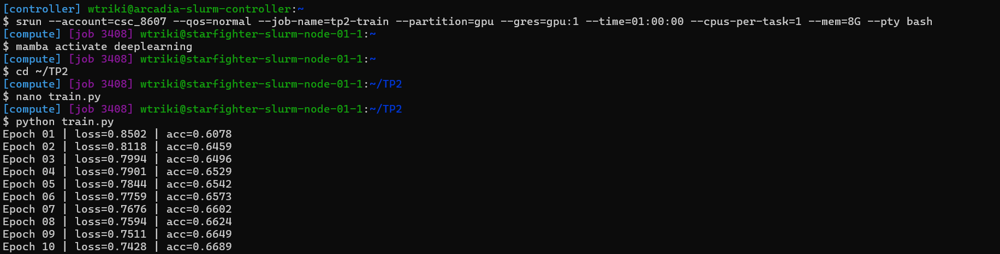
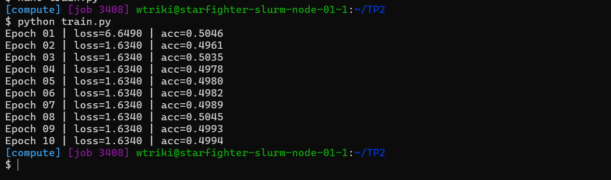

# TP2 — Régularisation, optimisation et métriques

**Auteur :** Wassim Triki
**Identifiant TSP :** wtriki

---

## 1. Création d'un dataset personnalisé

Dataset utilisé : Cardiovascular Disease dataset (Kaggle), chargé via une classe `CardioDataset` héritant de `torch.utils.data.Dataset`.

**Résultat du test du dataset :**


**Pourquoi `StandardScaler()` sur l'ensemble du dataset avant le split est une mauvaise pratique (data leakage) ?**

Le `StandardScaler` calcule la moyenne et l'écart-type de chaque colonne à partir des données qu'on lui fournit. En l'appliquant sur l'ensemble complet (train + val + test réunis) avant de séparer les sous-ensembles, les statistiques utilisées pour normaliser le train set intègrent indirectement des informations provenant du val et du test set — c'est une fuite d'information (**data leakage**). Le modèle profite alors, même subtilement, de connaissances qui ne devraient être disponibles qu'au moment de l'évaluation finale, ce qui rend la performance mesurée artificiellement optimiste par rapport à ce qu'on observerait sur de vraies nouvelles données. La bonne pratique consiste à calculer le `fit` du scaler uniquement sur le train set, puis à appliquer cette même transformation (`transform` seul, sans refaire `fit`) au val et au test set.

**Quelle classe PyTorch utiliser si le dataset est trop volumineux pour la RAM (ex: 500 Go) ?**

`torch.utils.data.IterableDataset`. Contrairement à `Dataset`, qui charge l'intégralité des données en mémoire et permet un accès direct par index via `__getitem__`, `IterableDataset` définit une méthode `__iter__` qui génère les exemples un par un (ou par morceaux) à la demande, typiquement en lisant le fichier progressivement depuis le disque (streaming), sans jamais charger l'ensemble des données en RAM.
## 2. MLP et Régularisation L1 / L2

Architecture : MLP à 2 couches cachées (128 neurones chacune), sortie sigmoïde pour classification binaire, loss `BCELoss`.

### Entraînement avec régularisation normale (l1_lambda=1e-4, l2_lambda=1e-3)




L'entraînement progresse normalement : la loss diminue régulièrement (de 0.85 à 0.74) et l'accuracy augmente de façon cohérente (de 60.8% à 66.9%), signe que le modèle apprend correctement à discriminer les patients à risque cardiovasculaire.

### Entraînement avec régularisation L1 trop forte (l1_lambda=0.1, l2_lambda=0)




**Observation :** après une première epoch instable, la loss se fige exactement à la même valeur (1.6340) à chaque epoch suivante, et l'accuracy stagne autour de 50% — le niveau du hasard pour une classification binaire.

**Explication :** une pénalité L1 aussi forte (0.1, soit 1000 fois plus élevée que la valeur normale de 1e-4) pousse l'optimiseur à écraser tous les poids du réseau à des valeurs quasi nulles en une ou deux itérations seulement. Une fois les poids proches de zéro, chaque couche linéaire produit une sortie quasi constante quelle que soit l'entrée : le réseau ne "voit" plus les données et se contente de prédire toujours la même chose. C'est pour cela que la loss devient une valeur figée (le modèle ne varie plus d'un batch à l'autre) et que l'accuracy retombe au niveau du hasard. Ce phénomène s'appelle le **sous-apprentissage (underfitting)** : le modèle est devenu trop contraint pour représenter quoi que ce soit d'utile, même sur les données d'entraînement.

**Quel argument de l'optimiseur permet d'appliquer la régularisation L2 automatiquement ?**

L'argument `weight_decay` de `torch.optim.SGD` (et de la plupart des optimiseurs PyTorch) applique automatiquement une pénalité L2 équivalente, sans avoir à la calculer manuellement dans la boucle d'entraînement :
```python
optimizer = optim.SGD(model.parameters(), lr=0.01, weight_decay=1e-3)
```

**Différence conceptuelle entre régularisation L1 et L2 sur les poids du réseau :**

La régularisation **L1** (somme des valeurs absolues) a tendance à pousser certains poids **exactement à zéro**, réalisant une forme de sélection automatique de features : le réseau "désactive" complètement certaines connexions qu'il juge inutiles, produisant des modèles parcimonieux (sparse). La régularisation **L2** (somme des carrés) pousse tous les poids à devenir **petits** de façon uniforme, mais très rarement exactement nuls — elle répartit son effet de façon plus douce sur l'ensemble des paramètres plutôt que d'en éliminer certains complètement.
